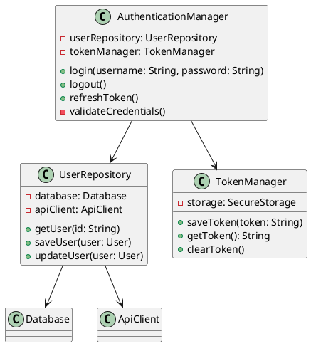
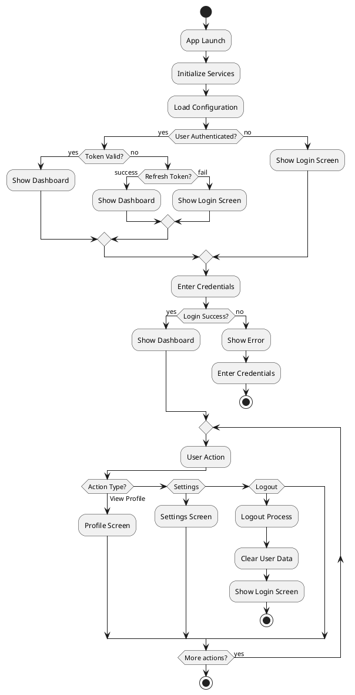
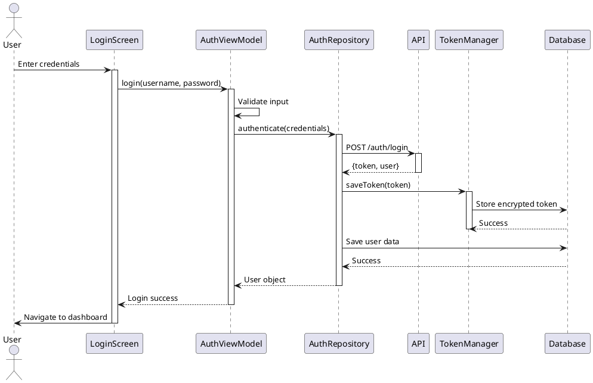
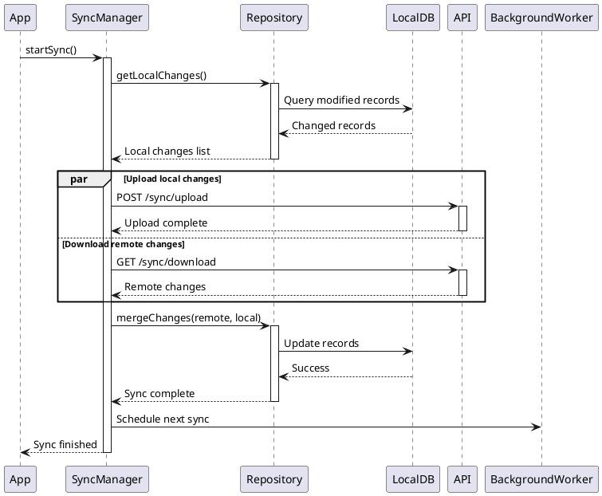
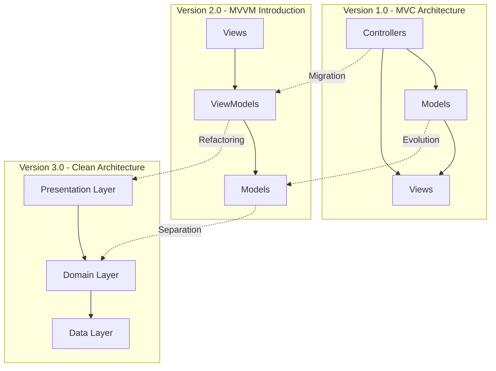
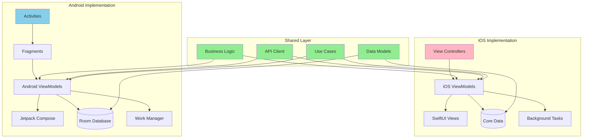
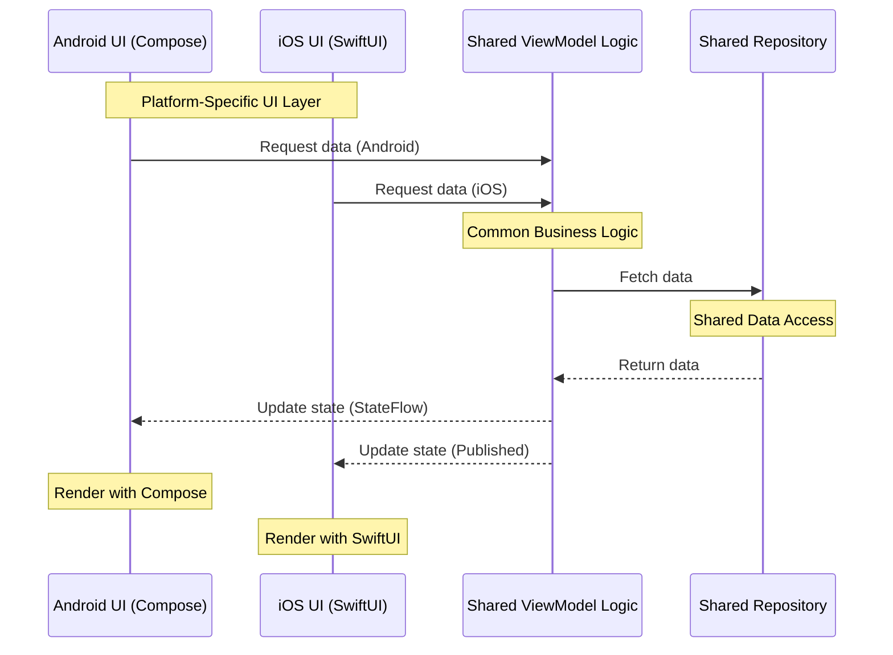

# Produce Diagrams Workflow

## Purpose

This automated workflow helps newcomers quickly understand a project by generating comprehensive project-specific diagrams and descriptions on the spot. With a basic prompt, users can automatically generate multiple types of diagrams that provide different perspectives of the project architecture, flow, and implementation.

## Trigger Commands

- `/produce-diagram.md Create project diagrams for [PROJECT_NAME]`
- `produce diagrams`
- `generate project diagrams`
- `create architecture diagrams`
- `diagram this project`

## What It Generates

This workflow produces the following diagrams with detailed descriptions:

1. **Class Diagrams** - Object-oriented structure showing classes, interfaces, and their relationships
2. **High-Level Flow Chart** - Overall system flow and main processes
3. **Sequence Diagrams by Module** - Component interactions and operation flows for each module
4. **Architectural Changes** - Evolution of architecture over time (if git history available)
5. **Differences Between Android & iOS** - Platform-specific implementations in diagrams

## Quick Start

Simply trigger with:
```
/produce-diagram.md Create project diagrams for MyProject
```

Or:
```
produce diagrams
```

Cline will automatically:
1. Analyze the codebase structure
2. Generate all diagrams using PlantUML (puml) syntax
3. Create detailed descriptions for each diagram
4. Save everything to `docs/diagrams/`
5. Generate an index file for easy navigation
6. Enable diagram preview in VS Code with PlantUML extension

## Automated Workflow

When triggered, Cline will execute the following steps automatically:

### Step 1: Codebase Analysis

```bash
# Identify project type and structure
- Detect programming languages (Java, Kotlin, Swift, Objective-C, etc.)
- Map package/module structure
- Identify architecture pattern (MVVM, MVC, Clean Architecture, etc.)
- Locate entry points (MainActivity, AppDelegate, etc.)
- Find configuration files
```

### Step 2: Generate Class Diagrams

Creates class diagrams for major modules showing:
- Classes and interfaces
- Inheritance hierarchies
- Composition and aggregation
- Method signatures
- Property types
- Design patterns

**Example Output:**


### Step 3: Create High-Level Flow Chart

Generates application-wide flow showing:
- App initialization
- Main user journeys
- Navigation between screens
- Decision points
- Key business logic

**Example Output:**


### Step 4: Generate Sequence Diagrams by Module

Creates detailed sequence diagrams for each major module showing:
- Component interactions
- API calls and responses
- Data flow
- Asynchronous operations
- Error handling

**Example Output - Authentication Module:**


**Example Output - Data Sync Module:**


### Step 5: Document Architectural Changes

Analyzes git history to show architecture evolution:
- Compare current vs previous structure
- Identify new modules/components
- Show refactored areas
- Document deprecated components
- Track architectural decisions

**Example Output:**


**Change Log:**
```markdown
## Architecture Evolution

### v1.0 → v2.0 (6 months ago)
- **Migration**: MVC to MVVM pattern
- **Added**: ViewModel layer for presentation logic
- **Removed**: Direct Model-View coupling
- **Benefit**: Better testability and separation of concerns

### v2.0 → v3.0 (3 months ago)
- **Migration**: MVVM to Clean Architecture
- **Added**: Domain layer with use cases
- **Added**: Repository pattern in data layer
- **Added**: Dependency injection (Hilt)
- **Refactored**: 45 classes reorganized
- **Benefit**: Better modularity and maintainability
```

### Step 6: Show Platform Differences (Android & iOS)

Creates comparison diagrams highlighting:
- Platform-specific implementations
- Shared business logic
- Native framework usage
- UI/UX variations
- API differences

**Example Output:**


**Platform Comparison Table:**

| Feature | Android | iOS | Shared |
|---------|---------|-----|--------|
| UI Framework | Jetpack Compose | SwiftUI | ✗ |
| Navigation | Navigation Component | NavigationStack | ✗ |
| Database | Room | Core Data | ✗ |
| Background Tasks | WorkManager | Background Tasks | ✗ |
| Networking | Retrofit | URLSession | ✓ (API models) |
| Business Logic | ViewModel | ViewModel | ✓ (Use cases) |
| Data Models | Kotlin data classes | Swift structs | ✓ (JSON mapping) |
| Authentication | AuthManager (Android) | AuthManager (iOS) | ✓ (Token logic) |

**Detailed Differences:**



## Output Structure

```
docs/
└── diagrams/
    ├── README.md                              # Index with navigation links
    │
    ├── class-diagrams/
    │   ├── authentication-module.md           # Auth classes and relationships
    │   ├── data-layer.md                      # Repository and data source classes
    │   ├── ui-components.md                   # UI/View layer classes
    │   ├── domain-layer.md                    # Use cases and business logic
    │   └── core-models.md                     # Data models and entities
    │
    ├── flow-charts/
    │   ├── app-initialization.md              # App startup flow
    │   ├── user-authentication-flow.md        # Login/logout flow
    │   ├── data-sync-flow.md                  # Background sync process
    │   ├── navigation-flow.md                 # Screen navigation
    │   └── error-handling-flow.md             # Error scenarios
    │
    ├── sequence-diagrams/
    │   ├── authentication-sequence.md         # Auth module interactions
    │   ├── api-integration-sequence.md        # API call flows
    │   ├── data-persistence-sequence.md       # Database operations
    │   ├── ui-interaction-sequence.md         # User interaction flows
    │   ├── background-sync-sequence.md        # Background tasks
    │   └── notification-sequence.md           # Push notification handling
    │
    ├── architecture/
    │   ├── current-architecture.md            # Current system overview
    │   ├── architecture-changes.md            # Evolution timeline
    │   ├── component-overview.md              # Component relationships
    │   └── layer-dependencies.md              # Layer dependency graph
    │
    └── platform-differences/
        ├── android-ios-comparison.md          # Side-by-side comparison
        ├── platform-specific-features.md      # Unique implementations
        ├── shared-components.md               # Cross-platform code
        ├── navigation-differences.md          # Platform navigation patterns
        └── ui-framework-comparison.md         # UI implementation differences
```

## Example Scenarios

### Scenario 1: New Developer Onboarding

```
User: /produce-diagram.md Create project diagrams for MyApp

Cline: Analyzing MyApp codebase...
       
       📊 Project Analysis Complete
       ━━━━━━━━━━━━━━━━━━━━━━━━━
       Project Type: Android Native (Kotlin)
       Architecture: Clean Architecture with MVVM
       Modules Detected: 4 (app, data, domain, presentation)
       Languages: Kotlin (95%), XML (5%)
       
       🎨 Generating Diagrams...
       
       ✓ Class Diagrams (5 modules)
         - authentication-module.md (12 classes)
         - data-layer.md (8 classes)
         - ui-components.md (15 classes)
         - domain-layer.md (6 classes)
         - core-models.md (10 classes)
       
       ✓ Flow Charts (5 flows)
         - app-initialization.md
         - user-authentication-flow.md
         - data-sync-flow.md
         - navigation-flow.md
         - error-handling-flow.md
       
       ✓ Sequence Diagrams (6 interactions)
         - authentication-sequence.md
         - api-integration-sequence.md
         - data-persistence-sequence.md
         - ui-interaction-sequence.md
         - background-sync-sequence.md
         - notification-sequence.md
       
       ✓ Architecture Documentation
         - current-architecture.md
         - architecture-changes.md (3 major versions)
         - component-overview.md
         - layer-dependencies.md
       
       ✓ Platform Differences (Android-only project)
         - android-implementation.md
       
       📁 Diagrams saved to: docs/diagrams/
       📖 View index at: docs/diagrams/README.md
       
       ━━━━━━━━━━━━━━━━━━━━━━━━━
       Summary:
       - 51 classes documented
       - 5 key user flows mapped
       - 6 interaction sequences created
       - Clean Architecture visualized
       - 3 architecture versions tracked
```

### Scenario 2: Cross-Platform Project Analysis

```
User: produce diagrams

Cline: Analyzing cross-platform codebase...
       
       📊 Project Analysis Complete
       ━━━━━━━━━━━━━━━━━━━━━━━━━
       Project Type: Cross-Platform (React Native)
       Platforms: Android & iOS
       Languages: JavaScript (70%), Java (15%), Swift (15%)
       
       🎨 Generating Diagrams...
       
       ✓ Class Diagrams (3 layers)
         - shared-components.md (20 components)
         - android-native-modules.md (5 modules)
         - ios-native-modules.md (4 modules)
       
       ✓ Flow Charts (4 flows)
         - app-initialization.md (cross-platform)
         - navigation-flow.md (React Navigation)
         - platform-bridge-flow.md
       
       ✓ Sequence Diagrams (5 interactions)
         - javascript-native-bridge.md
         - android-specific-sequence.md
         - ios-specific-sequence.md
         - shared-api-calls.md
       
       ✓ Platform Differences (detailed comparison)
         - android-ios-comparison.md
         - platform-specific-features.md
         - shared-components.md
         - navigation-differences.md
         - ui-framework-comparison.md
       
       📁 Diagrams saved to: docs/diagrams/
       
       ━━━━━━━━━━━━━━━━━━━━━━━━━
       Platform Analysis:
       - 20 shared JavaScript components
       - 5 Android-specific native modules
       - 4 iOS-specific native modules
       - 2 different navigation approaches documented
       - Platform bridge patterns visualized
```

### Scenario 3: Understanding Architecture Evolution

```
User: create architecture diagrams

Cline: Analyzing project history...
       
       📊 Git History Analysis
       ━━━━━━━━━━━━━━━━━━━━━━━━━
       Found 4 major architecture versions
       Analyzing 150+ commits over 18 months
       
       🎨 Generating Evolution Diagrams...
       
       ✓ Architecture Timeline
         v1.0 (18 months ago): Basic MVC
         v2.0 (12 months ago): MVVM migration
         v3.0 (6 months ago): Clean Architecture
         v4.0 (current): Modular Clean Architecture
       
       ✓ Migration Diagrams
         - mvc-to-mvvm-migration.md
         - mvvm-to-clean-migration.md
         - modularization-changes.md
       
       ✓ Component Evolution
         - deprecated-components.md
         - new-components.md
         - refactored-components.md
       
       📁 Saved to: docs/diagrams/architecture/
       
       ━━━━━━━━━━━━━━━━━━━━━━━━━
       Key Changes:
       - 45 classes refactored
       - 3 new layers introduced
       - 12 deprecated classes removed
       - Dependency injection added
       - Repository pattern implemented
```

## Detailed Diagram Descriptions

Each generated diagram includes:

### Class Diagram Descriptions

```markdown
# Authentication Module - Class Diagram

## Overview
This module handles user authentication, token management, and session persistence.

## Key Components

### AuthenticationManager
**Responsibility**: Orchestrates the authentication flow
- **Dependencies**: UserRepository, TokenManager
- **Key Methods**:
  - `login(username, password)`: Validates credentials and creates session
  - `logout()`: Clears session and user data
  - `refreshToken()`: Renews expired authentication token

### UserRepository
**Responsibility**: Manages user data persistence
- **Dependencies**: Database, ApiClient
- **Key Methods**:
  - `getUser(id)`: Retrieves user from local cache or API
  - `saveUser(user)`: Persists user data locally
  - `updateUser(user)`: Updates user information

### TokenManager
**Responsibility**: Secure token storage and retrieval
- **Dependencies**: SecureStorage
- **Key Methods**:
  - `saveToken(token)`: Encrypts and stores authentication token
  - `getToken()`: Retrieves and decrypts stored token
  - `clearToken()`: Removes stored token on logout

## Design Patterns
- **Repository Pattern**: UserRepository abstracts data sources
- **Dependency Injection**: Components receive dependencies via constructor
- **Single Responsibility**: Each class has one clear purpose

## Relationships
- AuthenticationManager **depends on** UserRepository (composition)
- AuthenticationManager **depends on** TokenManager (composition)
- UserRepository **depends on** Database and ApiClient (composition)
```

### Flow Chart Descriptions

```markdown
# User Authentication Flow

## Overview
Complete flow from app launch to authenticated dashboard, including error handling.

## Flow Steps

1. **App Launch**: User opens the application
2. **Initialize Services**: Load configuration, set up dependencies
3. **Check Authentication**: Verify if user has valid session
4. **Token Validation**: Check if stored token is still valid
5. **Dashboard or Login**: Route user based on authentication state
6. **Credential Input**: User enters username and password
7. **Authentication**: Validate credentials with backend API
8. **Success/Error Handling**: Navigate to dashboard or show error
9. **Session Management**: Maintain user session until logout

## Decision Points

- **User Authenticated?**: Checks for existing session
- **Token Valid?**: Validates token expiration
- **Login Success?**: Verifies credentials with API
- **User Action**: Handles user navigation choices

## Error Scenarios
- Invalid credentials → Show error, allow retry
- Expired token → Attempt refresh, fallback to login
- Network error → Show offline mode or error message
```

### Sequence Diagram Descriptions

```markdown
# Authentication Sequence - Login Flow

## Overview
Detailed interaction sequence for user login, from UI input to database storage.

## Participants

- **User**: End user interacting with the app
- **LoginScreen**: UI component displaying login form
- **AuthViewModel**: Presentation logic for authentication
- **AuthRepository**: Data layer managing auth operations
- **API**: Backend authentication service
- **TokenManager**: Secure token storage
- **Database**: Local data persistence

## Sequence Steps

1. User enters credentials in LoginScreen
2. LoginScreen forwards to AuthViewModel
3. AuthViewModel validates input format
4. AuthViewModel calls AuthRepository
5. AuthRepository makes API request
6. API returns token and user data
7. TokenManager encrypts and stores token
8. Database persists user information
9. Success flows back to UI
10. User navigates to dashboard

## Error Handling
- Input validation occurs in AuthViewModel
- Network errors caught in AuthRepository
- API errors handled with appropriate user messages
- Database failures logged and reported

## Asynchronous Operations
- API call runs on background thread
- Database operations are async
- UI updates on main thread
```

## Best Practices for Newcomers

### Reading the Diagrams

1. **Start with README.md**: Get overview of all available diagrams
2. **Check High-Level Flow**: Understand overall application flow
3. **Examine Class Diagrams**: Learn component structure by module
4. **Follow Sequence Diagrams**: Understand component interactions
5. **Review Architecture**: See how layers connect
6. **Compare Platforms**: Understand platform differences (if applicable)

### Using the Documentation

```markdown
# Recommended Reading Order for Newcomers

1. **docs/diagrams/README.md**
   - Get overview of project structure
   - Understand diagram organization

2. **docs/diagrams/architecture/current-architecture.md**
   - Understand overall architecture pattern
   - Learn layer responsibilities

3. **docs/diagrams/flow-charts/app-initialization.md**
   - See how app starts up
   - Understand initialization sequence

4. **docs/diagrams/class-diagrams/** (by module)
   - Study each module's structure
   - Learn component relationships

5. **docs/diagrams/sequence-diagrams/** (by feature)
   - Understand feature implementations
   - See how components interact

6. **docs/diagrams/platform-differences/** (if cross-platform)
   - Learn platform-specific code
   - Understand shared vs native components

7. **docs/diagrams/architecture/architecture-changes.md**
   - See how project evolved
   - Understand architectural decisions
```

## Advanced Features

### Custom Diagram Generation

```
User: produce diagrams for authentication module only

Cline: Focusing on authentication module...
       
       ✓ authentication-module class diagram
       ✓ login-flow sequence diagram
       ✓ token-refresh sequence diagram
       ✓ logout-flow sequence diagram
       
       Saved to: docs/diagrams/authentication/
```

### Include Specific Diagram Types

```
User: generate only class diagrams and sequence diagrams

Cline: Generating class and sequence diagrams...
       
       ✓ Class diagrams for all modules
       ✓ Sequence diagrams for key flows
       
       Skipping: Flow charts, architecture diagrams
```

### Depth Control

```
User: produce high-level diagrams only

Cline: Creating overview diagrams...
       
       ✓ High-level architecture diagram
       ✓ Main application flow chart
       ✓ Module overview diagram
       
       Skipping detailed class and sequence diagrams.
```

## Integration with Other Workflows

### With Git Workflows

```
User: produce diagrams and commit them

Cline: [Generates diagrams]
       [Commits with: "docs: add architecture diagrams"]
       [Syncs with remote]
```

### With Documentation

```
User: produce diagrams and update README

Cline: [Generates diagrams]
       [Updates project README with diagram links]
       [Commits documentation]
```

## Troubleshooting

### Issue: Missing Relationships

```
Cline: Some class relationships might be incomplete.
       Reasons:
       - Dynamic dependency injection
       - Runtime class loading
       - External library dependencies
       
       Recommendation: Review and add missing relationships manually
```

### Issue: Complex Flow

```
Cline: Flow chart is highly complex (50+ nodes).
       Creating focused sub-flows:
       - Main happy path flow
       - Error handling flow
       - Edge case flows
```

### Issue: Platform Detection

```
Cline: Unable to detect clear platform separation.
       Detected: Shared codebase (React Native/Flutter)
       
       Creating:
       - Shared component diagrams
       - Platform bridge diagrams
       - Native module diagrams
```

## Output Examples

### Generated README.md

```markdown
# Project Architecture Diagrams

**Generated**: 2025-02-12
**Project**: MyApp
**Architecture**: Clean Architecture with MVVM

## Quick Navigation

- [Class Diagrams](#class-diagrams)
- [Flow Charts](#flow-charts)
- [Sequence Diagrams](#sequence-diagrams)
- [Architecture](#architecture)
- [Platform Differences](#platform-differences)

## Overview

This directory contains automatically generated architecture diagrams for MyApp.
The diagrams use PlantUML syntax and can be viewed in:
- VS Code (with PlantUML extension)
- IntelliJ IDEA / Android Studio (with PlantUML integration plugin)
- Any PlantUML-compatible viewer
- Online at plantuml.com

## Class Diagrams

### Core Modules

- **[Authentication Module](class-diagrams/authentication-module.md)** (12 classes)
  - User authentication and session management
  - Token handling and refresh logic
  
- **[Data Layer](class-diagrams/data-layer.md)** (8 classes)
  - Repository pattern implementation
  - Data source abstraction
  
- **[UI Components](class-diagrams/ui-components.md)** (15 classes)
  - ViewModels and UI logic
  - Screen components

- **[Domain Layer](class-diagrams/domain-layer.md)** (6 classes)
  - Use cases and business logic
  - Domain models

- **[Core Models](class-diagrams/core-models.md)** (10 classes)
  - Data entities
  - Transfer objects

## Flow Charts

- **[App Initialization](flow-charts/app-initialization.md)**
  - Application startup sequence
  - Service initialization
  
- **[User Authentication](flow-charts/user-authentication-flow.md)**
  - Login/logout flow
  - Token refresh process
  
- **[Data Synchronization](flow-charts/data-sync-flow.md)**
  - Background sync process
  - Conflict resolution
  
- **[Navigation](flow-charts/navigation-flow.md)**
  - Screen navigation patterns
  - Deep linking handling
  
- **[Error Handling](flow-charts/error-handling-flow.md)**
  - Error scenarios
  - Recovery mechanisms

## Sequence Diagrams

### Authentication Module

- **[Authentication Sequence](sequence-diagrams/authentication-sequence.md)**
  - Login flow with API interaction
  - Token storage and validation

### Data Operations

- **[API Integration](sequence-diagrams/api-integration-sequence.md)**
  - REST API call patterns
  - Response handling

- **[Data Persistence](sequence-diagrams/data-persistence-sequence.md)**
  - Database operations
  - Cache management

### User Interactions

- **[UI Interaction](sequence-diagrams/ui-interaction-sequence.md)**
  - User input handling
  - Screen updates

### Background Operations

- **[Background Sync](sequence-diagrams/background-sync-sequence.md)**
  - Background task execution
  - Data synchronization

- **[Notifications](sequence-diagrams/notification-sequence.md)**
  - Push notification handling
  - User notification flow

## Architecture

- **[Current Architecture](architecture/current-architecture.md)**
  - Clean Architecture implementation
  - Layer separation and dependencies
  
- **[Architecture Changes](architecture/architecture-changes.md)**
  - Evolution from v1.0 to v4.0
  - Migration decisions and rationale
  
- **[Component Overview](architecture/component-overview.md)**
  - System-wide component relationships
  - Module boundaries
  
- **[Layer Dependencies](architecture/layer-dependencies.md)**
  - Dependency flow
  - Layer responsibilities

## Platform Differences

- **[Android vs iOS Comparison](platform-differences/android-ios-comparison.md)**
  - Side-by-side platform comparison
  - Feature parity analysis
  
- **[Platform-Specific Features](platform-differences/platform-specific-features.md)**
  - Unique Android implementations
  - Unique iOS implementations
  
- **[Shared Components](platform-differences/shared-components.md)**
  - Cross-platform business logic
  - Shared data models
  
- **[Navigation Differences](platform-differences/navigation-differences.md)**
  - Android Navigation Component
  - iOS NavigationStack/UINavigationController
  
- **[UI Framework Comparison](platform-differences/ui-framework-comparison.md)**
  - Jetpack Compose vs SwiftUI
  - Platform UI patterns

## Statistics

- **Total Classes**: 51
- **Modules**: 4 (app, data, domain, presentation)
- **Flow Charts**: 5
- **Sequence Diagrams**: 6
- **Architecture Versions**: 4
- **Platforms**: Android

## Maintenance

To regenerate these diagrams:
```
produce diagrams
```

**Last Updated**: 2025-02-12 16:14:55
**Generated By**: Cline Diagram Workflow
```

## Notes for Newcomers

- All diagrams use **PlantUML syntax** for professional diagram rendering
- **VS Code users**: Install the PlantUML extension for instant preview
- Diagrams are **automatically generated** from codebase analysis
- Start with the **README.md** for navigation
- Follow the **recommended reading order** above
- Diagrams may need **manual refinement** for complex scenarios
- **Architecture changes** require git history for comparison
- **Platform differences** only generated for cross-platform projects

## Related Workflows

- **[git-commit](git-commit.md)** - Commit generated diagrams
- **[jira-ticket-creation](jira-ticket-creation.md)** - Reference diagrams in tickets
